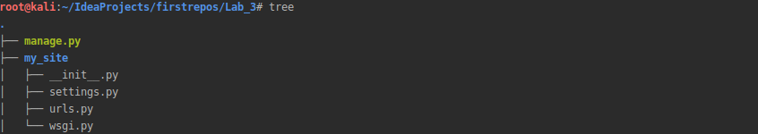
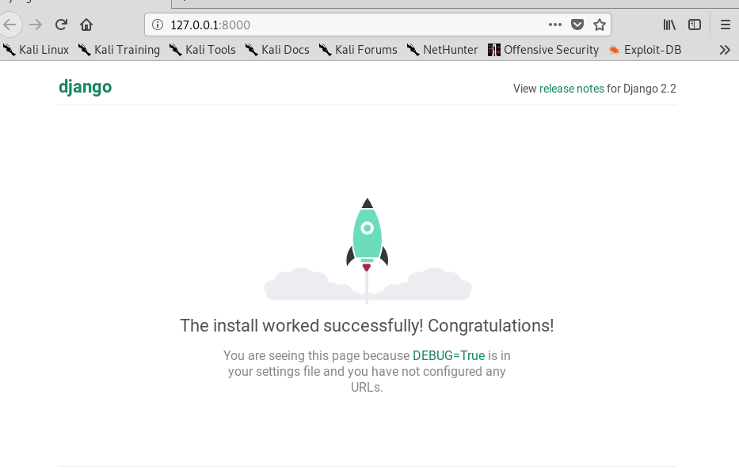

##### 1. Створив папку Lab_3, ініціалізував pipenv та встановив django

##### 2. Створив template і виніс всі файли на один рівень

##### 3. Запустив сервер і добавив файл db.sqlite3 в .gitignore

##### 4. Створив template додатку
##### 5. Створив відповідні файли і папки