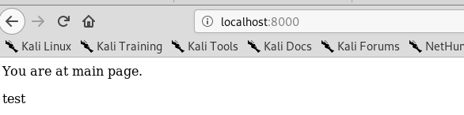

##### 1. Перевірив чи встановлений Docker, зберіг вивід команд у файл my_work.txt
##### 2. Завантажив базовий імедж, з репозиторію. Створив Dockerfile та скопіював його всміст.
##### 3. Створив власний репозиторій на Docker Hub [Link](https://cloud.docker.com/repository/registry-1.docker.io/tarasshynkler/firstrepos)
##### 4. Виконав білд Docker імеджа(Клята крапочка в кінці команди).
##### 5  Виправив помилки в Dockerfile та репозиторії на git hub, перебілдив імедж(Тутотчки я згорів. При виконанні білда беруться кешовані дані але --no-cache ніхто не відміняв.) Запустив веб сервер

##### 6. Переписав Dockerfile для програми моніторингу. Запустив контейнер і витягнув server.log