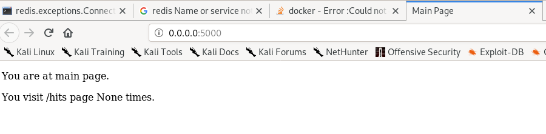
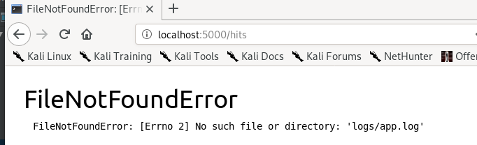
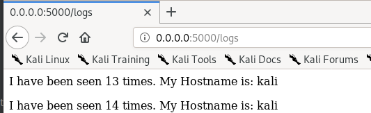
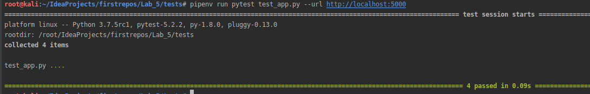

##### 1. Створив папки my_app & tests. Скопіював відповідні файли у свій репозитрій. Файли requirements.txt містять назви білбліотек використаних у проекті.
##### 2. Запускаємо проект і... І бачимо помилку шукаєм необхідні інструкції з дядьком гуглом виконуємо їх. Запускаємо... Ура успіхНе довго тривав успіх...Тут простіше. Бракує logs/app.log Допоможемо і створимо папку logs