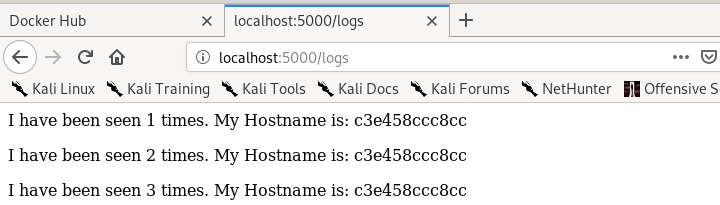
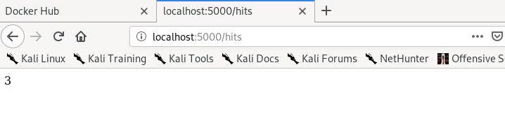
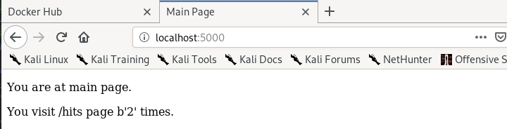
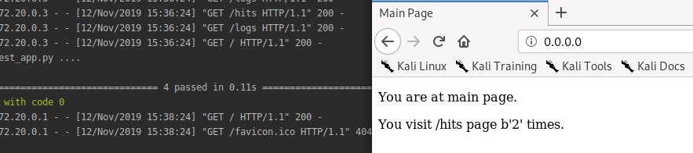
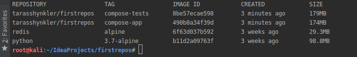

##### 1. Створив папки my_app & tests. Скопіював відповідні файли у свій репозитрій. Файли requirements.txt містять назви білбліотек використаних у проекті.
##### 2. Запускаємо проект і... І бачимо помилку шукаєм необхідні інструкції з дядьком гуглом виконуємо їх. Запускаємо... Ура успіх
##### Не довго тривав успіх...

##### Тут простіше. Бракує logs/app.log Допоможемо і створимо папку logs

##### 3. Видаляємо файли. І створюємо Dockerfile.app Dockerfile.tests Makefile
##### 4. Директиви Makefile
##### - STATES := app tests змінні яким динамічно присвоюються значення
##### - REPO := tarasshynkler/firstrepos:lab5 назва репозиторію на Docker Hub
##### - .PHONY: $(STATES) створює несправжні цілі
##### - run виконує команди
##### - docker-prune очищення ресурсів
##### 5. Виконуємо білд імеджів make app, make tests Запускаємо їх. Тести пройшли успішно

##### 6. Чистимо ресурси Docker make docker-prune
##### 7. Додаємо дериктиву push і команди. Виконуємо
##### 8. Додаємо дериктиву deleteimages і команду. Виконуємо
##### 9. Створюємо docker-compose.yml заповнюємо і редагуємо. Мережа secret потрібна щоб надати доступ до сховища тільки контейнеру з сервером. Контейнер з тестами стукається на public мережу
##### 10. Оновлюємо docker-compose до останньої версіїї і запускаємо. Контейнери запустились, тести пройшли успішно. Заходити потрібно на адресу 0.0.0.0 оскільки ми робили мапінг порта 80:5000

##### 11. Докер створив імеджі з тегами tarasshynkler/firstrepos:compose-tests tarasshynkler/firstrepos:compose-app Я змінив назви заздалегідь 
 
##### 12. docker-compose працює лише з докером. Якщо потрібно виконати системні команди або щось з системою краще makefile.